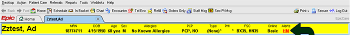
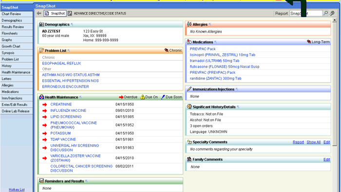
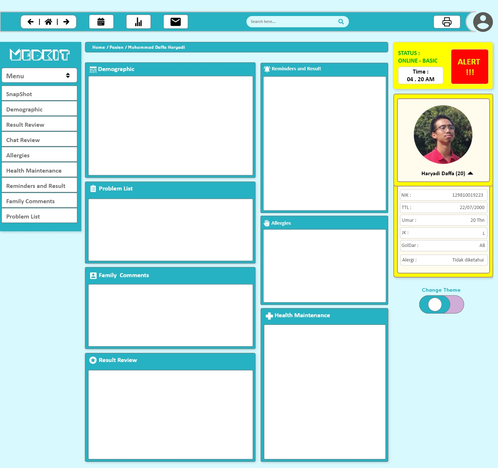
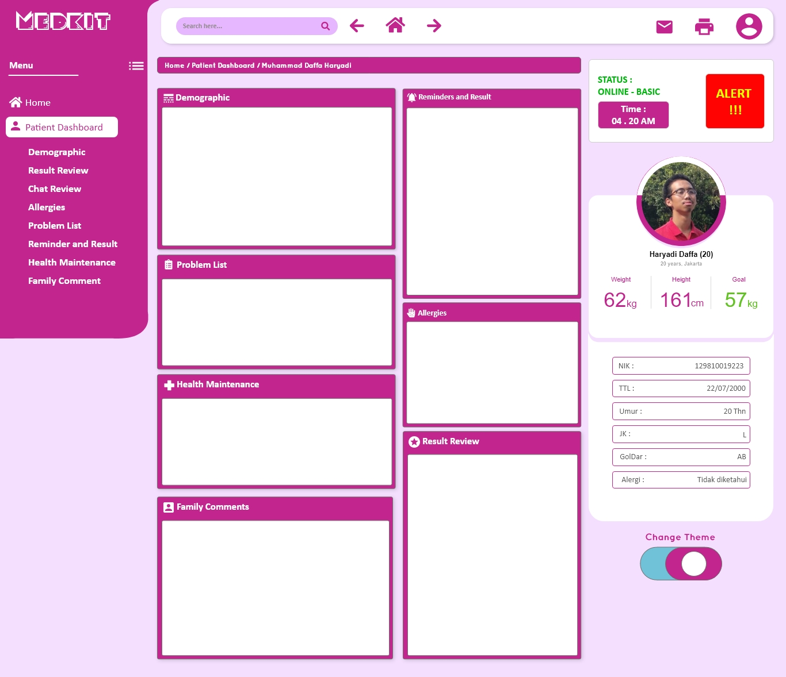

# TASK 1 : How bad UX killed Jenny #

## Abstraction ##

Peristiwa ini terjadi sekitar 9 Oktober 2014 (ditulis oleh Jonathan Shariat) yang disebabkan kekeliruan dari tiga perawat.

Insiden ini terjadi di rumah sakit, dengan korban Jenny (nama samaran). Yang sebelumnya Jenny itu seorang anak kecil yang terkena penyakit kanker selama empat tahun. Lalu, tiba saatnya dia diberikan pengobatan kemoterapi yang kuat. Jenny memerlukan infus 
pra hidrasi dan pasca hidrasi selama 3 hari. 

Setelah itu, tiga perawat mengisi data yang diperlukan pada software rumah sakit. Tetapi mereka melewatkan informasi penting terkait pemberian cairan infus pra dan pasca selama 3 hari. Padahal ketiga perawat tersebut sudah berpengalaman lebih dari 10 tahun. 
Keesokan harinya, Jenny meninggal karena keracunan dan dehidrasi. Sebab, melewatkan dua shift pemberian infus.

## Why this accident can be happened? ##

Insiden ini terjadi karena ketiga perawat tersebut bingung dalam memasukkan data ke dalam software,  Kesalahan terjadi karena ketika keadaan pasien sudah darurat perawat terlambat memberi peringatan di sistem rumah sakit dikarenakan rumitnya User Interface dan User Experience di Aplikasi sistem admin rumah sakit tersebut.

### Berikut merupakan tampilan dari software tersebut : 

Seperti yang terlihat di screenshot dari software tersebut, User Interface yang digunakan sangat rumit dan membingungkan.
hal ini sangat berbahaya apabila digunakan oleh orang yang tidak berpengalaman, bahkan seperti yang disebutkan diatas perawat yang sudah berpengalaman pun kebingungan saat menggunakannya.

## Design Flaws Analysis ##

Dalam User Interface software Admin rumah sakit tersebut terdapat banyak kesalahan, dan kami telah menemukan kerancuan dalam desain User Interface tersebut diantaranya adalah :

- Toolsbar and Identity bar
- Snapshot/Overview dan Sidebar

### Toolsbar and Identity bar ###

pada gambar diatas terlihat toolsbar dan identitiy bar, dengan toolsbar dan identity bar dibawahnya. Permasalahan pada tools bar adalah terdapat terlalu banyak menu dengan logo yang tidak jelas. Pada Identity bar kami menemukan kesalahan fatal yang mengakibatkan insiden yang telah kami sebutkan tadi, dalam identity bar terdapat button alert yang berfungsi untuk memberitahu staf Emergency bahwa terdapat kondisi darurat di kamar pasien tersebut, masalahnya button tersebut tidak terlihat menonjol dan terlihat plain, hal ini mengakibatkan user (perawat) sulit saat mengoperasikan software tersebut terutama saat keadaan darurat.

### Snapshot/overview dan Sidebar ###

Pada Overview page di software ini desain yang terlihat masih kurang efektif, terlalu banyak informasi yang ditampilkan dan kesan UI yang kurang modern, selain itu sidebar dapat diimprove lagi dengan membuat sidebar tersebut menjadi collapsing bar.

## Design Improvement ##

Setelah melihat Design awal software tersebut kami memutuskan untuk memperbaiki Desainnya terutama dibagian emergency button, profile pasien dan sidebar, berikut adalah perbaikan UI software tersebut :
- [x] Emergency button diperbesar dan dibuat menonjol dibanding tombol yang lain
- [x] Sidebar dibuat menjadi collapsing bar
- [x] toolsbar dibuat menjadi sederhana dengan logo yang mudah dikenali
- [x] overview/snapshot dibuat lebih mudah untuk dilihat

### UI MOCKUP TO IMPROVE THE DESIGN ###

## Daftar Pustaka ##
*How Bad UX Killed Jenny by Shariat, Jonathan* https://medium.com/tragic-design/how-bad-ux-killed-jenny-ef915419879e 
