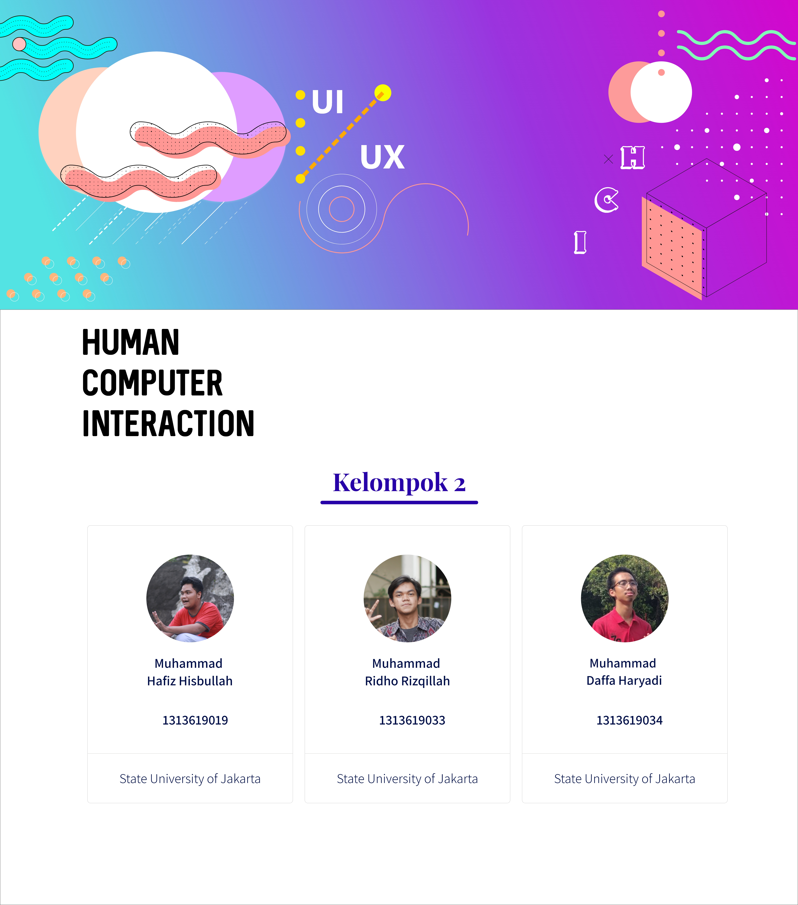

# First Assignment HCI 

## GROUP B ##

  1. Muhammad Daffa Haryadi   (1313619034)
  2. Muhammad Hafiz Hisbullah (1313619033)
  3. Muhammad Ridho Rizqillah (1313619019)

## This is Our team ##

## First Assignment ##

-  Find similar incident in the past record
-  Explain why the incident happened
-  Explain the design error
-  Provide suggestion to improve the design
-  Create a UX mockup to improve the design

*TASK 1 REPORT* : [When Bad UX design kill jenny](https://github.com/GeminorumB/HCI-task/tree/master/Assignment1)

## Second Assignment ##

- [x] interview an application designer (desktop/web/mobile) that have long term standing in UX design or have rich design portfolio

### Interviewee ###
-  Name       : Edwin Riwaldo
-  Occupation : UX Designer at [Flip.id](https://flip.id/)

*TASK 2 REPORT* : [Interview Report](https://github.com/GeminorumB/HCI-task/tree/master/assignment2)

Interview Record : [Youtube](https://www.youtube.com/watch?v=APQJQc1q9KA&feature=youtu.be)

### Contributors ###

* **Muhammad Daffa Haryadi** - *Ilmu Komputer 2019 Universitas Negeri Jakarta*: 
- [GeminorumB](https://github.com/GeminorumB)
* **Muhammad hAFIZ Hisbullah** - *Ilmu Komputer 2019 Universitas Negeri Jakarta*: 
- [hafizchever](https://github.com/hafizchever)
* **Muhammad Ridho RIzqillah** - *Ilmu Komputer 2019 Universitas Negeri Jakarta*: 
- [Renespeare](https://github.com/Renespeare)

### Check our landing page ##
[Our Github.io page](https://hafizchever.github.io/HCI_caseUI/laporan/case.html)
