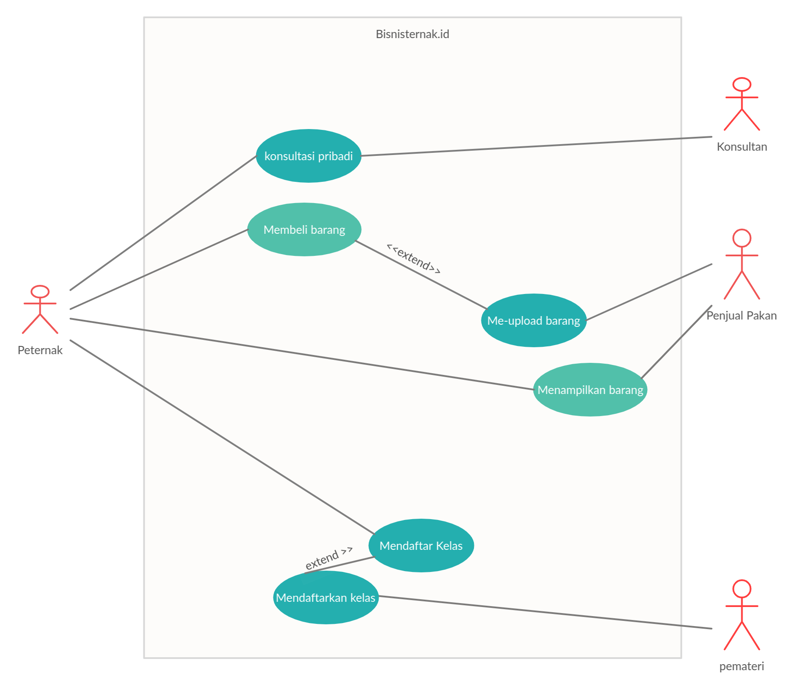

# Task 1 Report

## Design Flaw ##
Berikut kekurangan yang kami temukan di UI app bisnisternak.id:
- [x] Tombol home yang berada di bawah menjadi tak terjangkau
- [x] Pada bagian footer terdapat dua contact us
- [x] Banner di atas terlihat kontras
- [x] slide bar dibagian kiri terdapat dua 
- [x] Overall UI terlihat terlalu penuh dan tidak efektif

## Design app Bisnisternak.id ##

## Key Use case ##

Dalam sistem bisnisternak.id terdapat 4 fungsi penting yaitu:

- kelas peternak
- Informasi ternak
- Pasar ternak
- Konsultasi ternak

dalam fitur kelas peternak, peternak profesional dapat mengadakan kelas yang dapat diikuti
oleh peternak baru untuk memperbaiki *skill* yang dimiliki oleh peternak, di kelas peternak
ini terdapat kategori kelas yang dibagi berdasarkan materi pada kelas tersebut.
Sedangkan pada Informasi ternak terdapat artikel yang berkaitan dengan pengembangan ternak
tertetu, pada bagian ini artikel dibagi menjadi berbagai kategori berdasrkan jenis hewan di
artikel tersebut, kelemahan pada bagian ini adalah terlalu banyaknya kategori yang terlihat 
tidak efektif.

Selain dua bagian tersebut terdapat bagian Pasar Ternak dan Konsultasi ternak, pada bagian
pasar ternak, peternak dapat saling berjual beli dengan penjual pakan maupun bibit. Pada 
bagian ini barang dagangan dibagi menjadi beberapa kategori yang dapat dipilih. Sedangkan 
konsultasi ternak adalah fungsi bagi peternak untuk berkomunikasi dan bertanya pada peternak profesional, bagian ini juga di bagi menjadi beberapa kategori

## Activity Diagram ##

