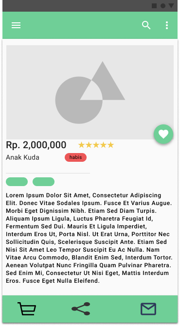
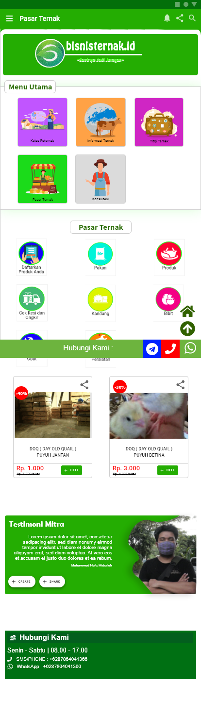

# Task 2 Report

Link for Our video's Subtitle :

[here](https://github.com/GeminorumB/HCI-task/tree/hw2/assignment2/subs)

### **Table of Content** ###

- Day 1: Discussion About Design Flaw
- Day 2: Creating two competing design
- Day 3: Voting on chosen design
- Day 4: Presenting the design to the developer

## Day 1 ##

**5 October 2020**

[Video](https://youtu.be/p8_5MEAKcIo)

## Day 2 ##

**6-8 October 2020**

### Design 1 ( M. Ridho Rizqillah ) ###
| | | 
|-|-|
|||

### Design 2 ( M. Hafidz Hisbullah ) ###
| | | 
|-|-|
|||

## Day 3

**9 October 2020**

[video](https://www.youtube.com/watch?v=wBA7AyuvgWM)

### Voters ###

- Abdullah Azzam
- Akbar Maulana
- M. Hanif Ramadhan
- M. Raffi Athallah M
- Hary Susilo

**Result** : 2nd Design Win (Hafiz Hisbullah's Design)

## Day 4 ##

**10 October 2020**

[video](https://www.youtube.com/watch?v=PtfIsxAiJkc)

- Nama : Dadang Firmansyah
- Role : Founder of Bisnisternak.id
