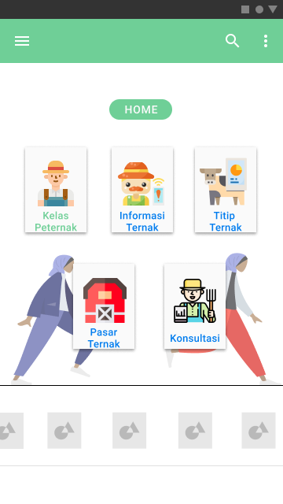
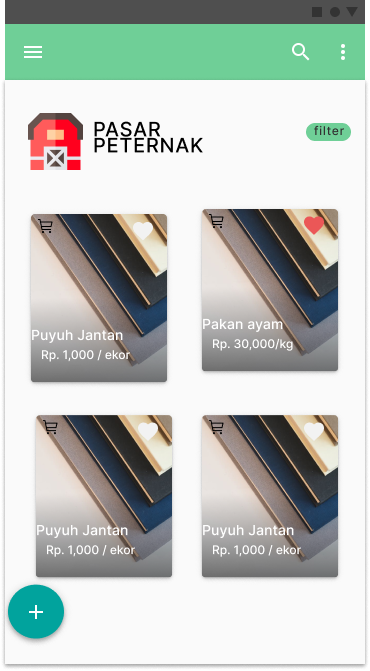
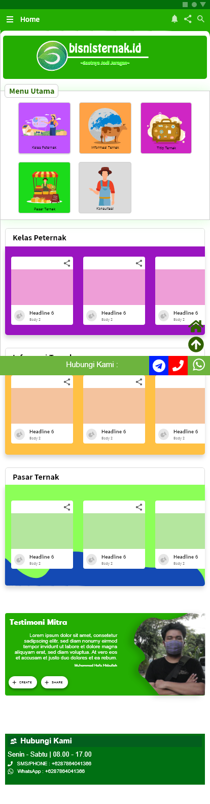

# Task 2 Report

### **Table of Content** ###

- Day 1: Discussion About Design Flaw
- Day 2: Creating two competing design
- Day 3: Voting on chosen design
- Day 4: Presenting the design to the developer

## App design before improvement

## Day 1 ##
[Video](https://youtu.be/p8_5MEAKcIo)

## Day 2 ##
### Design 1 ( M. Ridho Rizqillah ) ###
- Home Screen

- Pasar peternak page

### Design 2 ( M. Hafidz Hisbullah ) ###
- Home Screen

- Pasar peternak page

## Day 3
[video](https://www.youtube.com/watch?v=wBA7AyuvgWM)

## Day 4
[video](https://www.youtube.com)

